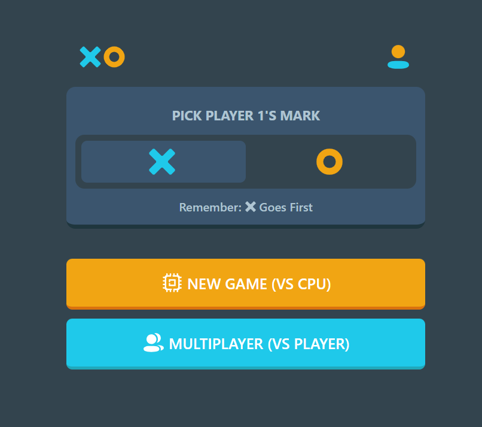
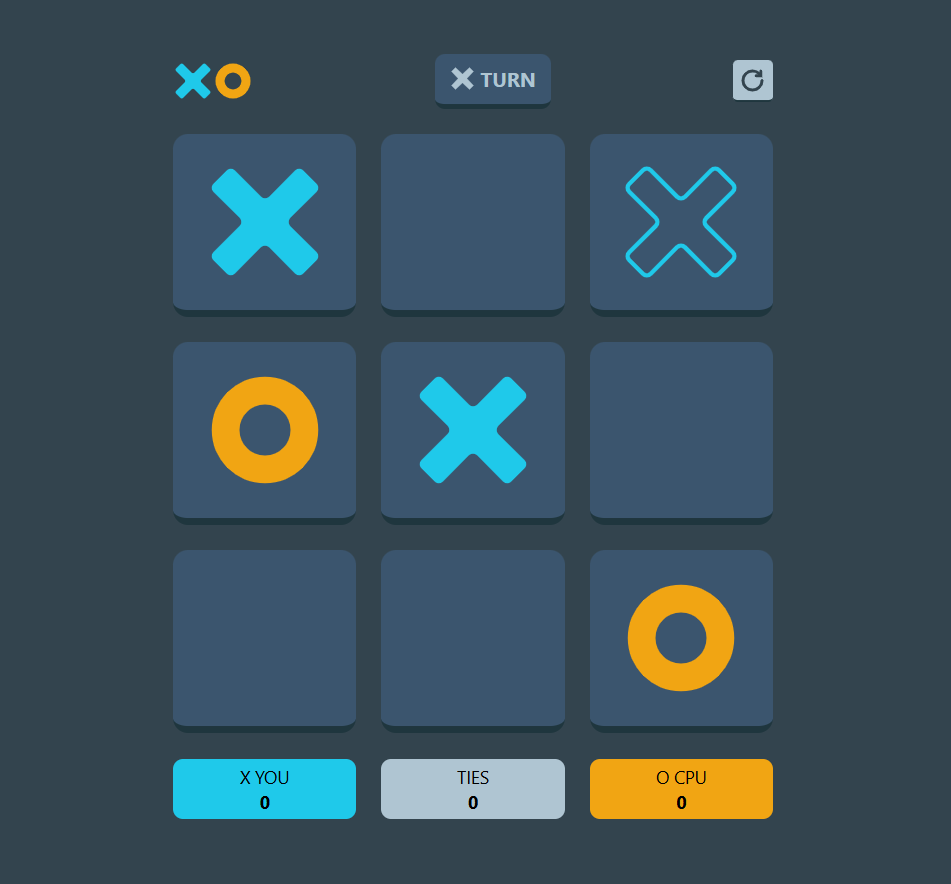
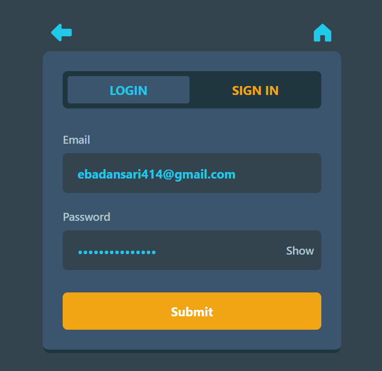

# 🎮 Tic Tac Toe – Multiplayer Web Game

A modern, interactive Tic Tac Toe game built with **React & Typescript**, designed for both fun and learning. This project supports **Player vs Player** and **Player vs Computer** modes and features a **real-time score monitor** that keeps track of wins and ties during gameplay.

## ✨ Features

- ✅ **React-based UI**: Clean and responsive user interface
- 🧠 **Computer AI**: Challenge a basic computer opponent
- 🧑‍🤝‍🧑 **Two-Player Mode**: Play with a friend on the same screen
- 📊 **Score Monitor**: Real-time score tracking across rounds
- 🌐 **Multiplayer Expansion** *(In Progress)*: Adding online multiplayer functionality using sockets or a backend system

  

## 🚀 How to Run

```bash
# Clone the repository
git clone https://github.com/ebadansari/tic-tac-toe.git

# Navigate to project folder
cd tic-tac-toe

# Install dependencies
npm install

# Start the app
npm start
